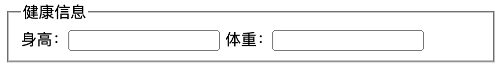

## 使用 `<fieldset>` + `<legend>` 给表单分组+设置标题

```html
fieldset 元素可将表单内的相关元素分组。

<fieldset> 标签将表单内容的一部分打包，生成一组相关表单的字段。

当一组表单元素放到 <fieldset> 标签内时，浏览器会以特殊方式来显示它们，它们可能有特殊的边界、3D 效果，或者甚至可创建一个子表单来处理这些元素。

<fieldset> 标签没有必需的或唯一的属性。

<legend> 标签为 fieldset 元素定义标题。
```

代码示例:
```html
<form>
  <fieldset>
    <legend>健康信息</legend>
    身高：<input type="text" />
    体重：<input type="text" />
  </fieldset>
</form>
```

预览:


也可以居中标题

```html
<form>
  <fieldset>
    <legend align='center'>健康信息居中对齐</legend>
    身高：<input type="text" />
    体重：<input type="text" />
  </fieldset>
</form>
````

预览:


参考链接: [W3school](https://www.w3school.com.cn/tags/tag_legend.asp)
