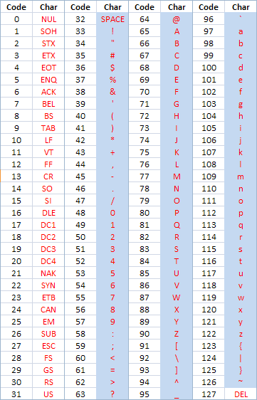

## [MDN 正则](https://developer.mozilla.org/zh-CN/docs/Web/JavaScript/Guide/Regular_Expressions)

## 推荐工具
- [在线的正则表达式测试和可视化工具](https://devtoolcafe.com/tools/regex#!flags=img&re=)

### 可打印字符(键盘可见字符)
> `/[ -~]/g`

看看这个 ASCII 表。可打印字符从空格开始，以波浪号结束（浅蓝色背景）。不可打印字符是所有剩余字符（白色背景）

### 正数
### 自然数