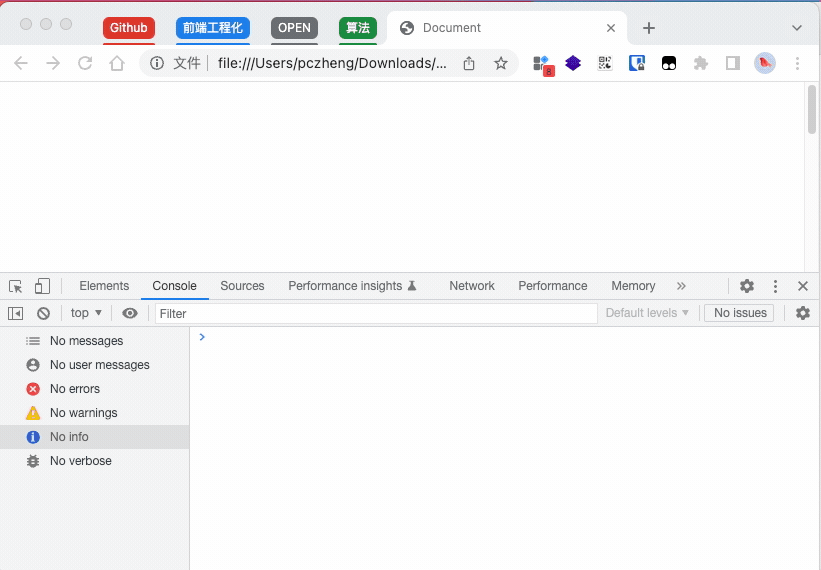

## 判断元素是否在视口中可见

使用 **IntersectionObserver** 观察器构造函数

```js
const observer = new IntersectionObserver(
  (entries) => {
    entries.forEach((entry) => {
      if (entry.isIntersecting) {
        // `entry.target` is the dom element
        console.log(`${entry.target.id} is visible`);
      }
    });
  },
  {
    threshold: 1.0,
  }
);
observer.observe(document.getElementById("my-button"));
```



<details>
  <summary>代码参考</summary>

  ```html
  <!DOCTYPE html>
    <html lang="en">
    <head>
      <meta charset="UTF-8">
      <meta http-equiv="X-UA-Compatible" content="IE=edge">
      <meta name="viewport" content="width=device-width, initial-scale=1.0">
      <title>Document</title>
    </head>
    <body>
      <div id="button" style="margin-top:300px">这是我的元素</div>
      <div id="button1" style="margin-top:300px">这是我的另一个元素</div>

    </body>
    <script type="module">

    const observer = new IntersectionObserver(
      (entries) => {
        entries.forEach((entry) => {
          if (entry.isIntersecting) {
            // `entry.target` is the dom element
            console.log(`${entry.target.id} is visible`);
          }
        });
      },
      {
        threshold: 1.0,
      }
    );
    observer.observe(document.getElementById("button"));
    observer.observe(document.getElementById("button1"));
    </script>
    </html>
    ```
</details>
