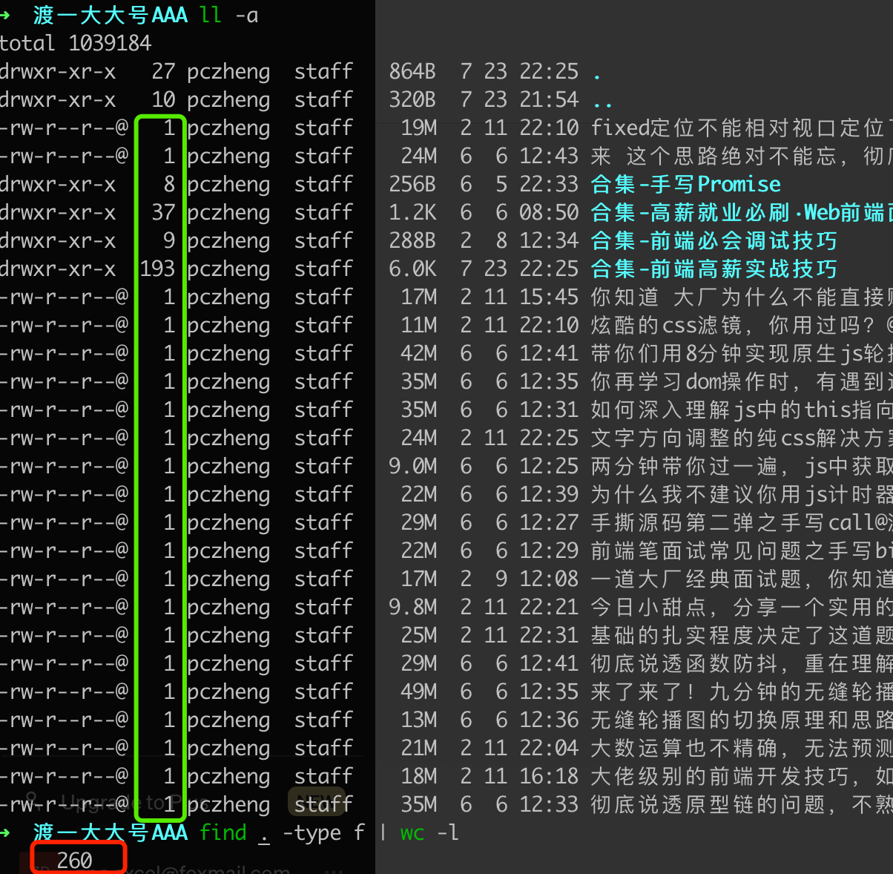

## 统计目录下的文件数量

### 删除 `.DS_Store` 隐藏文件

在 macOS 系统中，`.DS_Store` 文件是用来存储文件夹的自定义属性和显示设置的隐藏文件，而在 Linux 系统中通常并不需要这些文件。你可以使用 `find` 命令配合 `grep` 命令来过滤掉 `.DS_Store` 文件。

要过滤掉 `.DS_Store` 文件，可以执行以下命令：

```bash
find . -name ".DS_Store" -type f -delete
```

解释：

- `find .`: 表示从当前文件夹开始递归查找文件。
- `-name ".DS_Store"`: 表示查找文件名为 `.DS_Store` 的文件。
- `-type f`: 表示只查找普通文件，不包括目录和符号链接。
- `-delete`: 表示找到后将这些文件删除。

执行该命令后，所有 `.DS_Store` 文件将被删除。请注意，执行删除操作前建议备份重要数据，以防意外情况。

### 统计文件数量

要在 Linux 中查看当前文件夹下的所有文件，包括子目录中的文件数量，可以使用 `find` 命令配合 `wc` 命令来实现。

```bash
find . -type f | wc -l
```

解释：

- `find .`: 表示从当前文件夹开始递归查找文件。
- `-type f`: 表示只查找普通文件，不包括目录和符号链接。
- `|`: 管道符号，用于将 `find` 命令的输出传递给 `wc` 命令。
- `wc -l`: 统计输入的行数，即找到的文件数量。

执行该命令后，将会输出当前文件夹下及其子目录中所有文件的数量。

示例:

当前文件夹下一共有 260 个文件(删除 `.DS_Store` 后), 额外的, 260 = 途中绿色部分数量的和 - 文件夹的数量*2, `*2` 的原因是文件夹数量的统计中包含了 `.` 和 `..`

