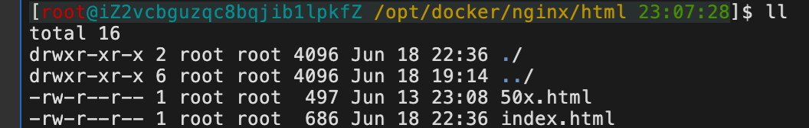

## Linux 修改终端显示样式

### 了解 PS1

`PS1` 是 Linux 终端用户的一个环境变量，用来定义命令行提示符的参数。

在终端输入命令：

```shell
$ set | grep PS1
```
或
```shell
$ echo $PS1
```

可得到当前 PS1 的定义值：

```shell
PS1='[\u@\h \W]\$ '
```

PS1 的常用参数以及含义:

- `\d`：代表日期，格式为 weekday month date，例如："Mon Aug 1"
- `\H`：完整的主机名称
- `\h`：仅取主机名中的第一个名字
- `\t`：显示时间为 24 小时格式，如：HH：MM：SS
- `\T`：显示时间为 12 小时格式
- `\A`：显示时间为 24 小时格式：HH：MM
- `\u`：当前用户的账号名称
- `\v`：BASH 的版本信息
- `\w`：完整的工作目录名称
- `\W`：利用 basename 取得工作目录名称，只显示最后一个目录名
- `#`：下达的第几个命令
- `$`：提示字符，如果是 root 用户，提示符为`#`，普通用户则为`$`

所以 linux 默认的命令行提示信息的格式`PS1='[\u@\h \W]$ '`的意思就是：`[当前用户的账号名称@主机名的第一个名字 工作目录的最后一层目录名]#`

### 颜色设置参数
在 PS1 中设置字符颜色的格式为：`[\e[F;Bm]`，其中“F“为字体颜色，编号为 30-37，“B”为背景颜色，编号为 40-47。

颜色对照表：

| F   | B   |
| --- | --- |
| 30  | 40  |
| 31  | 41  |
| 32  | 42  |
| 33  | 43  |
| 34  | 44  |
| 35  | 45  |
| 36  | 46  |
| 37  | 47  |

只需将对应数字套入设置格式中即可。比如要设置命令行的格式为绿字黑底（`[\e[32;40m]`），显示当前用户的账号名称（`\u`）、主机的第一个名字（`\h`）、完整的当前工作目录名称（`\w`）、24 小时格式时间（`\t`），可以直接在命令行键入如下命令：

```shell
$ PS1='[\[\e[32;40m\]\u@\h \w \t]$ '
```

经过多次测试后，最终确定了一个适合我自己的格式：

```shell
$ PS1='\[\e[37;40m\][\[\e[31;40m\]\u\[\e[36;40m\]@\h \[\e[33;40m\]\w \[\e[32;40m\]\t\[\e[0m\]]\\$ '
```

但注意这样的设置只是临时性的。

### 修改 `.bashrc` 文件，永久保存命令行样式。

上面的设置的作用域只有当前终端的登陆有效，关闭终端或退出登录即刻失效。要想永久性的保存设置，需要修改 `.bashrc` 配置文件。

```shell
$ vim .bashrc
```

加入这一行：
```shell
PS1='\[\e[37;40m\][\[\e[31;40m\]\u\[\e[36;40m\]@\h \[\e[33;40m\]\w \[\e[32;40m\]\t\[\e[0m\]]\\$ '
```

保存退出。
重新加载 bash 配置文件：
```shell
$ source .bashrc
```
### 效果展示

